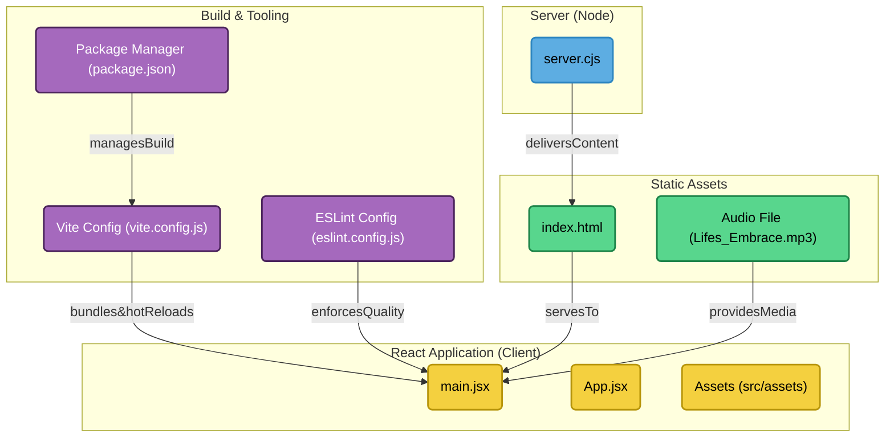

```mermaid
graph TD
    %% Build & Tooling Subgraph
    subgraph "Build & Tooling"
        vt("Vite Config (vite.config.js)"):::tooling
        pkg("Package Manager (package.json)"):::tooling
        eslint("ESLint Config (eslint.config.js)"):::tooling
    end

    %% React Application (Client) Subgraph
    subgraph "React Application (Client)"
        main("main.jsx"):::client
        app("App.jsx"):::client
        assets("Assets (src/assets)"):::client
    end

    %% Static Assets Subgraph
    subgraph "Static Assets"
        index("index.html"):::static
        audio("Audio File (Lifes_Embrace.mp3)"):::static
    end

    %% Server (Node) Subgraph
    subgraph "Server (Node)"
        server("server.cjs"):::server
    end

    %% Connections
    vt -->|"bundles&hotReloads"| main
    pkg -->|"managesBuild"| vt
    eslint -->|"enforcesQuality"| main
    index -->|"servesTo"| main
    audio -->|"providesMedia"| main
    server -->|"deliversContent"| index

    %% Click Events for Build & Tooling
    click vt "https://github.com/codedeficient/butterchurn/blob/master/vite.config.js"
    click pkg "https://github.com/codedeficient/butterchurn/blob/master/package.json"
    click eslint "https://github.com/codedeficient/butterchurn/blob/master/eslint.config.js"

    %% Click Events for React Application (Client)
    click main "https://github.com/codedeficient/butterchurn/blob/master/src/main.jsx"
    click app "https://github.com/codedeficient/butterchurn/blob/master/src/App.jsx"
    click assets "https://github.com/codedeficient/butterchurn/tree/master/src/assets"

    %% Click Events for Static Assets
    click index "https://github.com/codedeficient/butterchurn/blob/master/public/index.html"
    click audio "https://github.com/codedeficient/butterchurn/blob/master/public/audio_files/Lifes_Embrace.mp3"

    %% Click Event for Server (Node)
    click server "https://github.com/codedeficient/butterchurn/blob/master/server.cjs"

    %% Styles
    classDef tooling fill:#a569bd,stroke:#4a235a,stroke-width:2px,color:#ffffff;
    classDef client fill:#f4d03f,stroke:#b7950b,stroke-width:2px,color:#000000;
    classDef static fill:#58d68d,stroke:#1d8348,stroke-width:2px,color:#000000;
    classDef server fill:#5dade2,stroke:#2e86c1,stroke-width:2px,color:#000000;
``` 