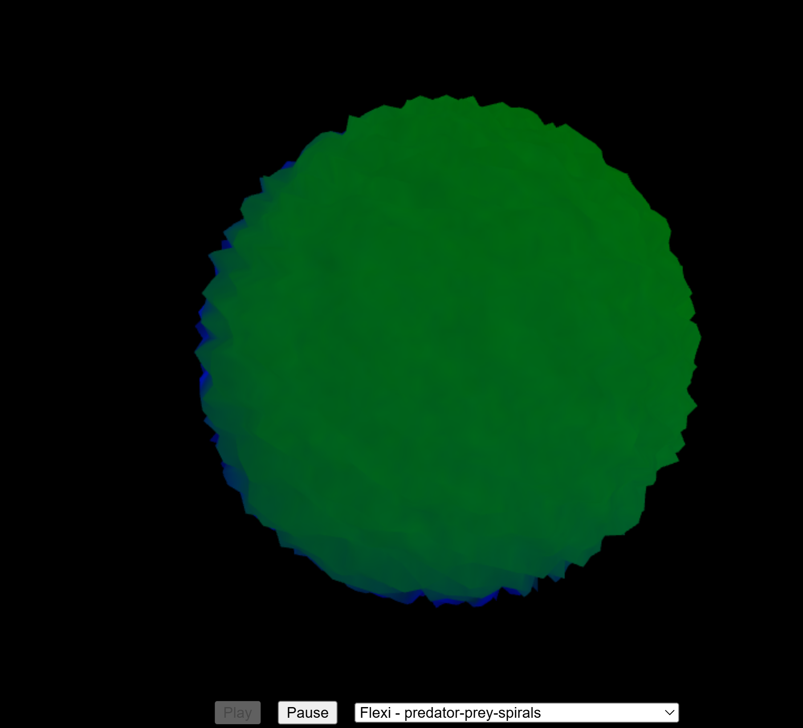
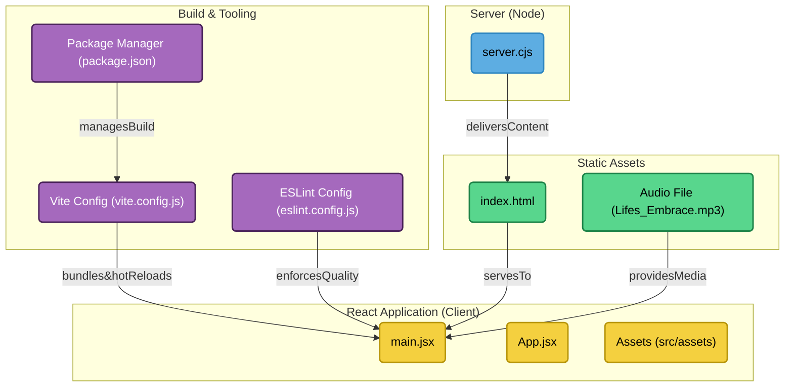

# Butterchurn 3D Sphere Visualizer

This project takes the classic Butterchurn (Milkdrop-style) music visualizations and maps them onto a dynamic, audio-reactive 3D sphere using Three.js and React.



## Features

*   Real-time audio visualization using Butterchurn.
*   Visualizations mapped onto a 3D sphere rendered with Three.js.
*   Sphere geometry deforms based on audio frequency analysis (bass, mids, treble) for a "breathing" or "ferrofluid" effect using custom shaders.
*   Butterchurn presets can be selected via a dropdown menu.
*   Basic playback controls (Play/Pause).
*   Built with Vite for fast development and optimized builds.
*   Includes a Dev Container configuration for a consistent development environment.

## How it Works

1.  **Audio Setup:** An HTML `<audio>` element loads the MP3 file. The Web Audio API (`AudioContext`, `MediaElementSource`, `AnalyserNode`) is used to process the audio.
2.  **Butterchurn Visualization:** The `butterchurn` library is initialized, connected to the `AnalyserNode`, and renders its 2D visualization to an offscreen (hidden) HTML `<canvas>` element. A selected preset dictates the visual style.
3.  **Three.js Scene:** A `three` scene is set up with a `SphereGeometry`.
4.  **Audio Analysis:** In the render loop, frequency data is obtained from the `AnalyserNode`. Average levels for bass, mid, and treble frequency bands are calculated and smoothed over time.
5.  **Shader Material:** The sphere uses a custom `ShaderMaterial`:
    *   **Vertex Shader:** Receives time and the smoothed bass/mid/treble levels as uniforms. It calculates a displacement value based on a noise function modulated by these audio levels. Each vertex of the sphere is moved along its normal by this displacement amount, creating the undulating effect.
    *   **Fragment Shader:** Receives the texture coordinates (UVs) from the vertex shader. It samples the Butterchurn visualization (from the hidden canvas, treated as a `CanvasTexture`) and applies that color to the fragment.
6.  **Texture Mapping:** The hidden Butterchurn canvas is used as the source for a `CanvasTexture`, which is applied to the sphere's `ShaderMaterial` (`tDiffuse` uniform).
7.  **Render Loop:** Each frame, the application:
    *   Gets audio data and calculates smoothed frequency levels.
    *   Updates the shader uniforms (`uTime`, `uBassLevel`, `uMidLevel`, `uTrebleLevel`).
    *   Renders Butterchurn to its hidden canvas.
    *   Updates the Three.js texture (`texture.needsUpdate = true`).
    *   Renders the Three.js scene (which applies the shaders and texture to the deformed sphere).
8.  **UI:** React is used to render the main component, the Three.js canvas container, and the UI controls (Play/Pause buttons, preset dropdown).

## Project Structure Diagram



## Running the Project

1.  **Clone the repository:**
    ```bash
    git clone https://github.com/CodeDeficient/butterchurn.git
    cd butterchurn
    ```
2.  **Install Dependencies:**
    ```bash
    npm install
    ```
3.  **Run the Development Server:**
    ```bash
    npm run dev
    ```
4.  Open the provided local URL (usually `http://localhost:5173`) in your browser.

### Using the Dev Container (Recommended)

1.  Ensure you have Docker installed and running.
2.  Ensure you have the VS Code "Dev Containers" extension (or similar functionality in your editor, like Cursor).
3.  Open the cloned project folder in VS Code/Cursor.
4.  Click "Reopen in Container" when prompted, or use the command palette (`Ctrl/Cmd+Shift+P`) to run "Dev Containers: Rebuild and Reopen in Container".
5.  The container will build, dependencies will be installed automatically (`npm install`), and the environment will be ready.
6.  Run `npm run dev` inside the container's integrated terminal.

## Acknowledgements & Citations

This project builds upon several fantastic open-source libraries:

*   **Butterchurn:** The core WebGL Milkdrop implementation.
    *   Original Source: [jberg/butterchurn](https://github.com/jberg/butterchurn)
    *   This Project Fork: [CodeDeficient/butterchurn](https://github.com/CodeDeficient/butterchurn.git)
    *   Presets: Uses `butterchurn-presets`.
*   **Three.js:** Used for 3D rendering, geometry, materials, and shaders. [https://threejs.org/](https://threejs.org/)
*   **React:** Used for building the user interface components. [https://react.dev/](https://react.dev/)
*   **Vite:** Used as the development server and build tool. [https://vitejs.dev/](https://vitejs.dev/)

Special thanks to the creators of Milkdrop and the many preset authors whose work makes Butterchurn possible.
